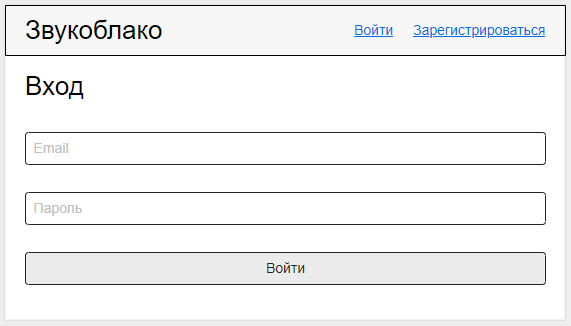
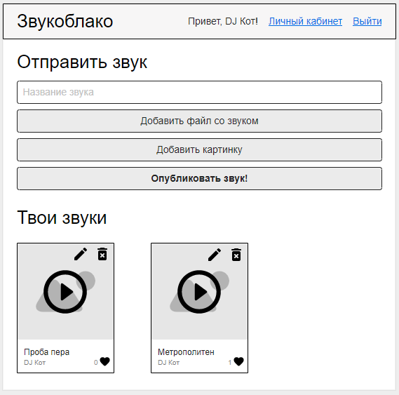

# Exam: Звукоблако

## Введение

Тебе предстоит создать уникальный сервис - "Звукоблако".
Пользователи будут записывать крутые мелодии и выкладывать их в сеть.
Другие пользователи смогут их оценить и прокомментировать.

*Важно:*
Делай `git push` только один раз (в 16.00), в течение экзамена ничего пушить не нужно!

**Сначала прочитай всё задание целиком!**

Если не получается сделать какой-то релиз, переходи к следующему.

## Release 0

Убедись, что в твоем проекте есть .gitignore, eslint, установлены все 
необходимые библиотеки.

Подумай, из каких частей будет состоять твоё приложение, спроектируй базу данных.

## Release 1: Главная страница

Для начала создай главную страницу. На ней будут ссылки на вход и регистрацию.

Так как ты еще не аутентифицирован, появится предупреждающая запись.

И самое главное - список популярных звуков пользователей, отсортированных в 
порядке убывания лайков. Каждый звук - это:
* Картинка
* Название
* Автор
* Кнопка лайка
* Количество лайков
* Кнопка воспроизведения

При нажатии на лайк проставляется лайк (если ты аутентифицирован, иначе - 
перебрасывает на страницу входа). 

При нажатии на кнопку воспроизведения запускается проигрывание звука.
Если ты боишься реализовывать воспроизведение, оставь эту задачу на конец.

## Release 2: Регистрация

Для регистрации нужно ввести:
* Email
* Псевдоним
* Пароль

## Release 3: Вход

Пользователь должен иметь возможность входить в систему.

## Release 4: Главная страница с аутентификацией

После успешной аутентификации главная страницы выглядит немного иначе.
Добавляется возможность добавить свой звук.
А в шапке наш ожидает приветственное сообщение, ссылка на личный кабинет и 
кнопка выхода из системы.

## Release 5: Профиль

На странице профиля можно также отправить свой звук. Ко всему прочему там 
есть список всех отправленных звуков с возможность удалить любой из них.

Более того, есть кнопка редактирования. О ней в следующем релизе.

## Release 6: Редактирование

При переходе на страницу редактирования мы видим ту же форму, что и 
при добавлении, только с уже заполненным названием и немного другими 
метками кнопок. При нажатии "опубликовать" не создаётся новый звук, а 
обновляется уже существующий.

## Release 7: Страница звука

Данной страницей можно поделиться с друзьями. Здесь мы видим всю 
информацию о звуке, а также комментарии других пользователей.

Если пользователь аутентифицирован, он даже сможет добавить свой 
комментарий.

Все остальные кнопки работают так же, как и на других страницах.

## Release 8: Авторизация

Убедись, что другие пользователи не могут редактировать твои звуки. 
Лайки и оставление комментариев должны быть доступны только тем, кто 
уже вошёл в систему. Хакеру не поможет даже `postman`, ведь ты 
защитил роуты на бэкенде?

## Release 9: Seeder

Создай сидер, если ты ещё этого не сделал. Заполни базу 20+ случайными 
пользователями и 200+ звуками.

## Заключение

Ты можешь делать столько коммитов, сколько тебе нужно. Однако, пожалуйста, не исполняй команду `git push` до окончания экзамена. Не искушай своих одногруппников подсматривать твой код.
